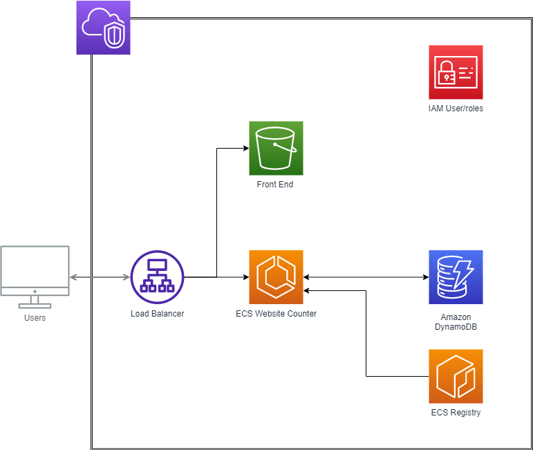

# ECS Website project

This is a terraform project in which a website counter was containerised and 
provisioned as IaC. 

The first step for my terraform project was to architect the solution, and create a brand new vpc with 3 seperate subnets. From there an application load balancer was created with a rule-based forwarding rule that listens out on port 80. The ALB was configured so that any uri with /counter would be pointed to the ECS service, while the rest would be forwarded to the S3 bucket. 

All of the front-end assets (html, css, image) were placed in an S3 bucket due to their static nature. 

With regards to the JS code in the S3 bucket, a link would have been fetched from a route 53 cname record to apply on the domain to the AWS Application Load Balancer - which would have updated the front end HTML for the visitor counter on the site. 

There was a requirement for an IAM user with a dynamodb permission role attached to it. The ECS was configured with 3 parts - the task, the service and the cluster using the FARGATE severless setting. For the time being, a single task definition was created with the potential for more to be added. 

We created a dockerfile with rules of how to package and containerise the code. 
We added in a requirements.txt file to specify the python packages that would be required and built off a python based image. This was to ensure the container was as small as possible (which is important with regards to scaling up further containers). From here, we built the docker image and pushed it to the GCR repository (the steps are found below). 

Iterating further it would be nice to have set the remote terraform state to an S3 bucket rather than storing it in a git repo to allow developers to work concurrently on project together.

If we used github actions, we would have applied a trigger on the master branch, such that anytime a change has been made, a new version would have been tagged to the github repo and container, and a new container would have been pushed to GCR. In addition, I would have seperated the terraform source code and application source code into two seperate repos allowing each to have a different CI/CD pipeline. 

The infrastructure diagram below could have been implemented using diagrams as code (DAC) to give the benefit of versioning infrastructure design changes. 




## Terraform QuickStart

1. Install providers and modules
    ```shell
    terraform init
    ``` 

2. Plan Terraform changes
    ```shell
    terraform plan
    ``` 

3. Apply Terraform changes 
    ```shell
    terraform apply 
    ```

## Docker QuickStart

1. get authentication
    ```shell
    aws ecr get-login-password --region us-east-1 | docker login --username AWS --password-stdin 517586233148.dkr.ecr.us-east-1.amazonaws.com
    ```

2. Build image (make sure you are in same directory as counter)
    ```shell
    docker build . -t 517586233148.dkr.ecr.us-east-1.amazonaws.com/counter
    ```

3. Push image to ecr
   ```shell
   docker push 517586233148.dkr.ecr.us-east-1.amazonaws.com/counter
   ```